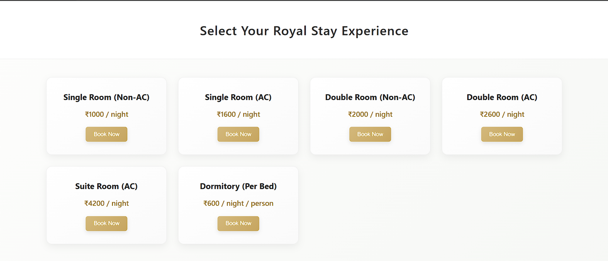
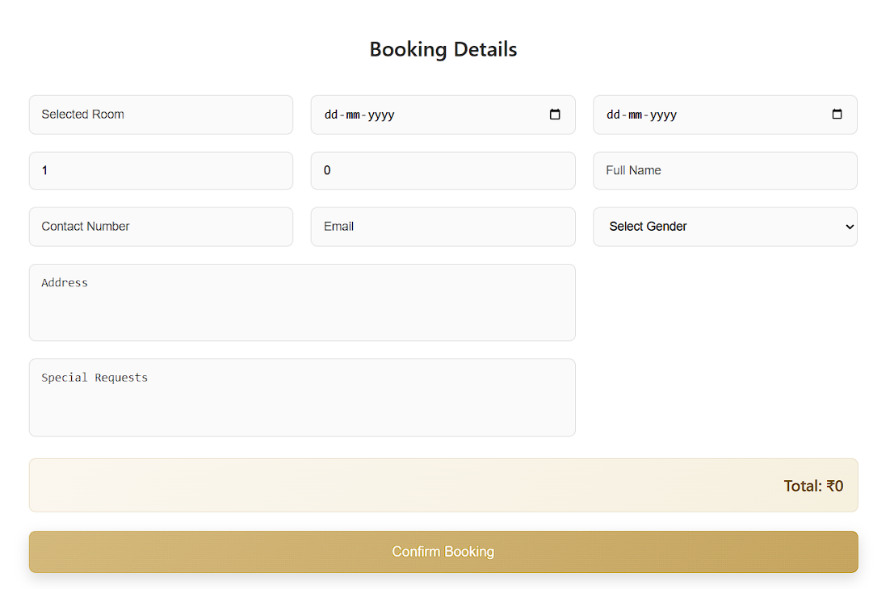
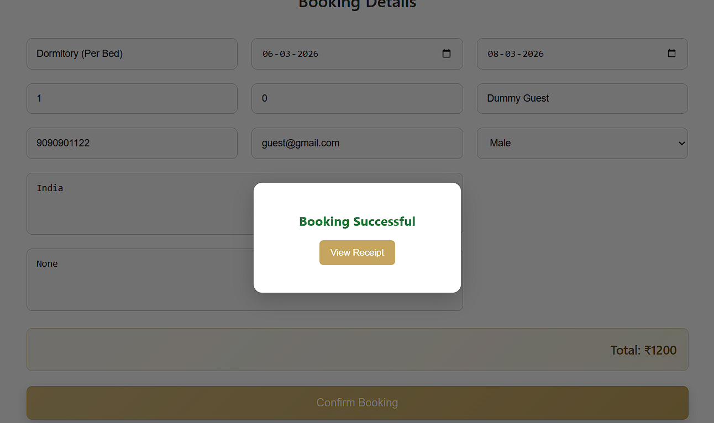
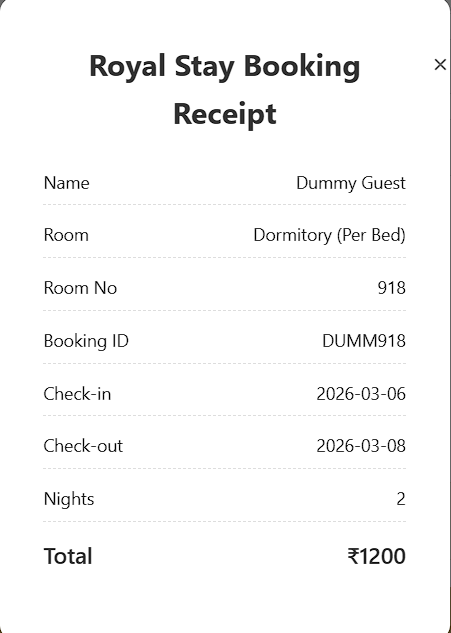

# Hotel_Booking_Form
# Royal Stay Booking System 🏨

A responsive **Hotel Booking Web Application** that allows users to select room types, fill booking details, calculate total cost automatically, and generate a booking receipt.

This project demonstrates **front-end web development skills using HTML, CSS, and JavaScript** with a clean UI and interactive booking workflow.

---

## Features

* Multiple room options (Single, Double, Suite, Dormitory)
* Check-in and Check-out date selection
* Guest count (Adults & Children)
* Automatic booking cost calculation
* Guest information form
* Booking processing animation
* Generated booking receipt
* Responsive and modern UI design
* Clean card layout with hover effects

---

## Tech Stack

**Frontend**

* HTML5
* CSS3
* JavaScript

**Tools**

* VS Code
* Git
* GitHub

---

## Project Structure

```
Royal-Stay-Booking
│
├── index.html
├── style.css
├── script.js
├── icon.png
├── README.md
│
└── screenshots
    ├── rooms.png
    ├── booking-form.png
    ├── booking-success.png
    └── receipt.png
```

---

## How to Run the Project

1. Clone the repository

```
git clone https://github.com/yourusername/royal-stay-booking.git
```

2. Live Link : 
https://tanvipohankar-004.github.io/Hotel_Booking_Form/
---

## 📸 Project Screenshots

### Room Selection



Users can choose different room categories based on preference.

---

### Booking Form



Guests enter booking details including dates, guest count, contact and other required information.

---

### Booking Confirmation



A processing animation confirms that the booking is successful.

---

### Booking Receipt



The system generates a receipt displaying booking ID, room number, total nights, and final amount
with check-in and check-out dates and other user details.

---

## 🚀 Future Improvements

* User login system
* Manager/Admin dashboard
* Database integration
* Online payment gateway
* Real-time room availability

---

## 👩‍💻 Author

**Tanvi Pohankar**
BE | CSE@26

---

## ⭐ Support

If you like this project, consider giving it a **star ⭐ on GitHub**.
